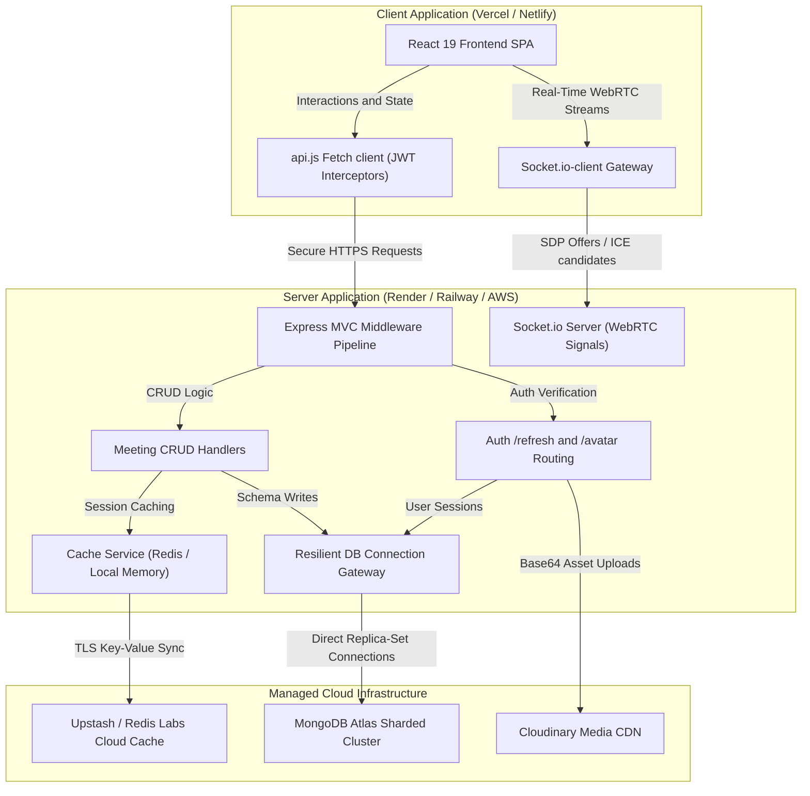
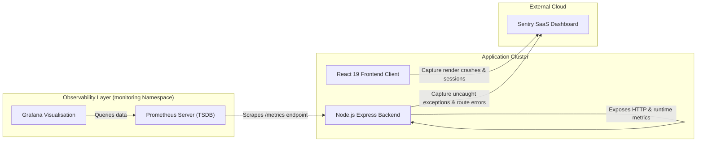

# 🌌 IntellMeet – AI-Powered Enterprise Meeting & Collaboration Platform
### *Production-Grade Full-Stack MERN Application with Real-Time Video, AI Meeting Intelligence & Team Collaboration*

---

## 📋 Project Identity
* Title: IntellMeet – AI-Powered Enterprise Meeting & Collaboration Platform
* Subtitle: Production-Grade Full-Stack MERN Application with Real-Time Video, AI Meeting Intelligence & Team Collaboration
* Author: Shanjivkkumar Ramasamy | Dhvani Padaliya
* Domain: Web Development (MERN) Domain Portfolio Reference
* Date: March/April 2026
* Version: *2.0 – Industry Edition*
* Status: Deployed & Hardened

---

## 1. 💼 Business Case & Production Objectives
Meetings are one of the single largest productivity drains in modern enterprises. Employees spend hours taking notes, compiling summaries, and manually assigning action items rather than focusing on actual work. 

*IntellMeet* resolves this by turning every team meeting into an actionable, trackable event on autopilot:
* Reduce meeting follow-up overhead by 40–60%: Fully automated transcription, summary generation, and action item extraction using Gemini/OpenAI API means teams spend zero time drafting follow-up emails.
* Improve task completion rate by 25–40%: Direct conversion of meeting action items into Kanban workspace tasks ensures critical decisions are never forgotten or lost in chat logs.
* Support high concurrency scales: Engineered to support between *500–5,000* concurrent participants, catering to enterprise town halls and large-scale cross-functional syncs.
* Guarantee 99.95% availability SLA: A fault-tolerant architecture utilizing offline in-memory fallback stores and connection retry loops ensures meetings can proceed even if external cloud services experience downtime.

---

## ⚙️ Core Architecture & Flow Diagram
IntellMeet operates as a decoupled Monorepo containing:
1. `/client`: A high-fidelity React 19 single-page application built on Vite, styled with premium Vanilla CSS tokens.
2. `/server`: A Twelve-Factor cloud-native Express backend combined with an event-driven Socket.io signaling server.



---

## 2. ⚡ Core Functional Requirements

| ID | Feature Capability | Detailed Description & Business Value | Key Acceptance Criteria & Production Metrics |
| :--- | :--- | :--- | :--- |
| *F01* | *User Authentication & Profiles* | Secure signup/login using stateless, short-lived Access JWTs and long-lived Refresh JWTs. Profile management handles avatars resiliently. | Cryptographic password hashing (bcryptjs), secure session cookie storage, and full profile CRUD. |
| *F02* | *Real-Time Video Meetings* | Video conferencing room utilizing WebRTC peer connections with audio, video, and screen share controls. | Low latency WebRTC relay (<200ms) and automatic mesh state tracking. |
| *F03* | *AI Meeting Intelligence* | Automatic meeting transcription, summary extraction, and action item determination powered by Google Gemini API. | Accurate summarization and automated assignee parsing with high readability. |
| *F04* | *Real-Time Collaboration* | In-meeting bidirectional chat and live presence indicators syncing across participants. | Sub-100ms real-time event dispatching powered by Socket.io. |
| *F05* | *Post-Meeting Dashboard* | Complete historical directory of previous meetings, summaries, and action item compliance logs. | Full search queries on transcripts, descriptions, and summaries. |
| *F06* | *Team Workspace Boards* | Kanban-style workspace board allowing teams to assign tasks and manage progress. | Interactive card dragging, status changes, and due dates. |
| *F07* | *Productivity Analytics* | Date-based trend charts, task completion percentages, and productivity scoring based on meeting follow-ups. | High-fidelity interactive metrics charts. |

---

## 🛠️ Production Technology Stack

| Layer | Primary Technology | Rationale | Alternatives Considered |
| :--- | :--- | :--- | :--- |
| *Frontend* | React 19 + TypeScript + Vite | Fast Hot Module Replacement (HMR) and optimized build bundles. | Next.js (rejected to keep frontend hosting flexible). |
| *UI Styling* | Vanilla CSS Variable Tokens | Total stylistic freedom, clean loading speed, and glassmorphic theme styling. | Tailwind CSS (avoided for clean modular styling control). |
| *State Management* | Zustand | Ultra-lightweight, reactive, and boilerplate-free state management. | Redux Toolkit (deemed too heavy for this application scope). |
| *Backend* | Node.js + Express | Highly scalable, asynchronous event loops perfect for handling API connections. | NestJS (avoided for quick turnaround). |
| *Database* | MongoDB + Mongoose | Highly flexible document models for meetings, tasks, and action lists. | PostgreSQL (rejected due to strict schema overhead). |
| *Real-Time Gateway*| Socket.io + WebRTC | Industry-standard low-latency P2P media connections and bidirectional events. | WebRTC peerjs / raw WebSockets. |
| *Cache Layer* | Redis | TLS-enabled key-value synchronization for production caching. | Memory Cache (retained as local offline fallback). |
| *AI Intelligence* | Groq API (Llama 3.3 70B) | High-throughput, low-latency meeting intelligence summaries and action items extraction. | Google Gemini 1.5 Flash / OpenAI GPT-4o (migrated to Groq for higher limits and sub-second execution speeds). |
| *Observability / APM* | Sentry (v8 SDKs) | Full stack code-level exception logging, runtime tracing, and privacy-safe user session replay logs. | LogRocket / Loggly (rejected due to Sentry's superior React 19 compatibility and native OpenTelemetry integration). |
| *Metrics & Dashboards* | Prometheus + Grafana | High-precision time-series metrics collection, process telemetry, and visual system health dashboarding. | Datadog / New Relic (rejected to prevent SaaS vendor lock-in and keep metrics open-source). |
| **Orchestration** | Kubernetes + Helm | High availability, auto-scaling deployment pods, and clean package updates. | Docker Compose alone (retained for local development). |

---

## 💾 Database Schemas (Mongoose)

### 1. User Model (`User.model.js`)
Stores account information and login role credentials.
```javascript
{
  name: {
    type: String,
    required: [true, 'Name is required'],
    trim: true,
    maxlength: [50, 'Name cannot exceed 50 characters']
  },
  email: {
    type: String,
    required: [true, 'Email is required'],
    unique: true,
    lowercase: true,
    trim: true,
    match: [/^\S+@\S+\.\S+$/, 'Please provide a valid email address'],
    index: true
  },
  password: {
    type: String,
    required: [true, 'Password is required'],
    minlength: [8, 'Password must be at least 8 characters long'],
    select: false // Excludes passwords from query results by default
  },
  role: {
    type: String,
    enum: {
      values: ['ADMIN', 'MEMBER', 'GUEST'],
      message: '{VALUE} is not a valid role. Allowed roles: ADMIN, MEMBER, GUEST'
    },
    default: 'MEMBER'
  },
  avatar: {
    type: String,
    default: ''
  }
}
// Middleware: Pre-save hook hashes password using bcryptjs (12 salt rounds) if modified.
// Methods: comparePassword(candidatePassword) resolves hash comparison.
```

### 2. Session Model (`Session.model.js`)
Tracks active tokens and login origins for account lifecycle audits.
```javascript
{
  user: {
    type: mongoose.Schema.Types.ObjectId,
    ref: 'User',
    required: true,
    index: true
  },
  token: {
    type: String,
    required: true,
    index: true
  },
  device: {
    type: String,
    default: 'Unknown Device'
  },
  ipAddress: {
    type: String,
    default: 'Unknown IP'
  },
  lastActive: {
    type: Date,
    default: Date.now
  }
}
```

### 3. Meeting Model (`Meeting.model.js`)
Holds configuration, participant history, transcripts, and AI-compiled intelligence data.
```javascript
{
  title: {
    type: String,
    required: [true, 'Meeting title is required'],
    trim: true,
    maxlength: [100, 'Meeting title cannot exceed 100 characters']
  },
  description: {
    type: String,
    trim: true,
    maxlength: [500, 'Meeting description cannot exceed 500 characters']
  },
  host: {
    type: mongoose.Schema.Types.ObjectId,
    ref: 'User',
    required: [true, 'Meeting host reference is required'],
    index: true
  },
  participants: [
    {
      type: mongoose.Schema.Types.ObjectId,
      ref: 'User'
    }
  ],
  status: {
    type: String,
    enum: {
      values: ['SCHEDULED', 'ACTIVE', 'COMPLETED'],
      message: '{VALUE} is not a valid meeting status. Allowed: SCHEDULED, ACTIVE, COMPLETED'
    },
    default: 'SCHEDULED',
    index: true
  },
  startTime: {
    type: Date,
    required: [true, 'Meeting start time is required']
  },
  endTime: {
    type: Date
  },
  scheduledDate: {
    type: String,
    trim: true
  },
  scheduledTime: {
    type: String,
    trim: true
  },
  duration: {
    type: Number,
    default: 30
  },
  summary: {
    type: String,
    default: ''
  },
  keyDiscussionPoints: {
    type: [String],
    default: []
  },
  aiGenerated: {
    type: Boolean,
    default: false
  },
  lastSummarizedTranscript: {
    type: String,
    default: ''
  },
  transcript: {
    type: String,
    default: ''
  },
  actionItems: [
    {
      text: { type: String, required: true },
      completed: { type: Boolean, default: false },
      assignee: { type: String, default: '' }
    }
  ]
}
```

### 4. Task Model (`Task.model.js`)
Handles collaborative Kanban board tasks linked to users and meeting decisions.
```javascript
{
  title: {
    type: String,
    required: [true, 'Task title is required'],
    trim: true
  },
  description: {
    type: String,
    trim: true,
    default: ''
  },
  status: {
    type: String,
    enum: {
      values: ['TODO', 'IN_PROGRESS', 'REVIEW', 'DONE'],
      message: '{VALUE} is not a valid task status. Allowed: TODO, IN_PROGRESS, REVIEW, DONE'
    },
    default: 'TODO',
    index: true
  },
  assignee: {
    type: mongoose.Schema.Types.ObjectId,
    ref: 'User',
    index: true
  },
  assigneeName: {
    type: String,
    default: ''
  },
  dueDate: {
    type: Date
  },
  meetingId: {
    type: mongoose.Schema.Types.ObjectId,
    ref: 'Meeting',
    index: true
  },
  position: {
    type: Number,
    default: 0
  },
  creator: {
    type: mongoose.Schema.Types.ObjectId,
    ref: 'User',
    required: [true, 'Task creator is required'],
    index: true
  }
}
```

### 5. User Settings Model (`UserSettings.model.js`)
Configures settings preferences, themes, notifications, and client behavior parameters.
```javascript
{
  user: {
    type: mongoose.Schema.Types.ObjectId,
    ref: 'User',
    required: true,
    unique: true,
    index: true
  },
  emailNotifications: { type: Boolean, default: true },
  meetingReminders: { type: Boolean, default: true },
  taskReminders: { type: Boolean, default: true },
  aiSummaryNotifications: { type: Boolean, default: true },

  theme: { type: String, enum: ['light', 'dark', 'system'], default: 'dark' },
  compactMode: { type: Boolean, default: false },
  fontSize: { type: String, enum: ['small', 'medium', 'large'], default: 'medium' },

  joinMicOn: { type: Boolean, default: false },
  joinCamOn: { type: Boolean, default: false },
  autoLiveCaptions: { type: Boolean, default: true },
  defaultDuration: { type: Number, default: 30 },
  recordingPreference: { type: String, enum: ['cloud', 'local', 'none'], default: 'cloud' },

  enableAiSummaries: { type: Boolean, default: true },
  enableActionItems: { type: Boolean, default: true },
  enableLiveTranscription: { type: Boolean, default: true },
  aiLanguage: { type: String, default: 'en-US' },

  twoFactorEnabled: { type: Boolean, default: false },
  twoFactorMethod: { type: String, enum: ['app', 'sms', 'email', 'none'], default: 'none' },
  privacyControls: {
    shareAnalytics: { type: Boolean, default: true },
    publicProfile: { type: Boolean, default: false }
  },

  defaultWorkspace: { type: String, default: 'My Workspace' },
  teamPreferences: {
    allowInvites: { type: Boolean, default: true },
    restrictDomain: { type: String, default: '' }
  },
  kanbanPreferences: {
    defaultColumn: { type: String, default: 'TODO' },
    autoArchiveDone: { type: Boolean, default: false }
  }
}
```

---

## 📂 Codebase File Directory Structure

### Backend Server Structure (`/server`)
```
/server
├── Dockerfile
├── package.json
├── package-lock.json
├── .env
├── .env.example
└── /src
    ├── app.js               # Express application configuration setup
    ├── server.js            # Server entrypoint and graceful shutdown signals
    ├── /config              # DB connection and Environment variable checking
    │   ├── db.js
    │   ├── dbInit.js        # Self-healing index compiling and admin seeding
    │   └── env.js
    ├── /controllers         # Route request logic handlers
    │   ├── analytics.controller.js
    │   ├── auth.controller.js
    │   ├── meeting.controller.js
    │   ├── task.controller.js
    │   └── user.controller.js
    ├── /middleware          # Request routing verification filters
    │   ├── auth.middleware.js
    │   ├── error.middleware.js
    │   └── rateLimit.middleware.js
    ├── /models              # Mongoose collection models
    │   ├── Meeting.model.js
    │   ├── Session.model.js
    │   ├── Task.model.js
    │   ├── User.model.js
    │   └── UserSettings.model.js
    ├── /routes              # Express pipeline routers
    │   ├── analytics.routes.js
    │   ├── auth.routes.js
    │   ├── meeting.routes.js
    │   ├── task.routes.js
    │   └── user.routes.js
    ├── /services            # Core database transactional code
    │   ├── ai.service.js
    │   ├── auth.service.js
    │   └── meeting.service.js
    ├── /sockets             # Real-time message/WebRTC signalling relays
    │   └── socket.server.js
    └── /utils               # Shared helpers
        ├── AppError.js
        ├── jwt.utils.js
        ├── logger.js
        └── seedDB.js
```

### Frontend Client Structure (`/client`)
```
/client
├── Dockerfile
├── package.json
├── index.html
├── vite.config.js
├── nginx.conf
└── /src
    ├── App.jsx              # Client router mapping
    ├── main.jsx             # React DOM renderer
    ├── /pages               # Core tab layouts
    │   ├── Dashboard.jsx
    │   ├── LandingPage.jsx
    │   ├── Login.jsx
    │   ├── Register.jsx
    │   └── Room.jsx
    ├── /components          # Shared functional layout components
    │   ├── Sidebar.jsx
    │   ├── /analytics
    │   │   └── AnalyticsDashboard.jsx
    │   ├── /room
    │   │   ├── AiNotesPanel.jsx
    │   │   ├── ChatPanel.jsx
    │   │   ├── ParticipantsPanel.jsx
    │   │   ├── RoomControls.jsx
    │   │   ├── RoomHeader.jsx
    │   │   └── VideoGrid.jsx
    │   ├── /settings
    │   │   └── MeetingSettings.jsx
    │   └── /tasks
    │       └── TaskBoard.jsx
    └── /utils               # Session and client configurations
        └── api.js
```

---

## 🔒 Security Hardening & OWASP Top 10 Mitigation

IntellMeet is hardened against modern web application security threats:

1. Broken Object Level Authorization (BOLA/IDOR) Protection:
   * *Mitigation*: Meeting-specific resource paths (`GET /api/meetings/:id` and `POST /api/meetings/:id/summarize`) validate if the requesting user (`req.user.id`) is either the Host, an active Participant, or an Administrator. Unauthorized requests immediately throw a `403 Forbidden` error.
2. ReDoS & Regular Expression Injection Protection:
   * *Mitigation*: Custom utility methods escape all input strings (`escapeRegExp`) prior to generating database search queries (e.g. matching task assignees), neutralizing attempts to crash servers with catastrophic backtracking.
3. Helmet HTTP Header Hardening:
   * *Mitigation*: Automatically configures secure headers (XSS Filter, Clickjacking protection, Referrer Policy) on all server responses.
4. CORS Strict Access-Control:
   * *Mitigation*: Configures origin filters so only the authorized production frontend domains (`*.vercel.app`, `*.netlify.app`) and the configured `CLIENT_URL` can connect.
5. Rate-Limiting (Brute-Force Shield):
   * *Mitigation*: Authentication endpoints are throttled to a maximum of `30 requests per 15 minutes` to protect against credential stuffing.
6. Stateless Session Control:
   * *Mitigation*: Employs short-lived Access JWTs (15m expiry) and robust Refresh JWTs (7d expiry) with absolute database revocation checks.

---

## 📅 28-Day Execution Timeline

### Week 1 – Core Backend & Authentication Foundation
* Day 1: Monorepo structure setup, environment variable validation (`env.js`), and MongoDB connection initialization with custom retry hooks.
* Day 2: Mongoose schema declarations for `User` and `Session`. Formulated JWT access/refresh lifecycle functions and cryptographically hashed passwords.
* Day 3: Protected routes middleware (`authenticateJWT` and `requireRoles`) implementation, and auth rate limiting setup.
* Day 4: `Meeting` schemas and CRUD controller logic mapping. WebRTC peer connection relay handler endpoints setup.
* Day 5: Sockets server integration and Redis caching synchronization.
* Day 6: Bidirectional chat message events over Socket.io namespaces.
* Day 7: Week 1 Checkpoint: Backend API routes verified using Postman.

### Week 2 – Frontend & Real-Time Meeting Core
* Day 8: React 19 client initialization using Vite, configuring CSS variables for glassmorphic dark mode styling.
* Day 9: Authenticated layout routes and Axios interceptor setups to handle token refreshes automatically.
* Day 10: Video conference room lobby, handling webcam and audio track capture.
* Day 11: Chat panel drawer integration inside the conference room with live message bubbles.
* Day 12: Screen sharing capabilities using browser `getDisplayMedia` tracks.
* Day 13: Active room participant presence indicators.
* Day 14: Week 2 Checkpoint: End-to-end multi-user meeting room testing completed.

### Week 3 – AI Intelligence & Collaboration Features
* Day 15: Web Speech recognition API integration, parsing microphone input into a chronological transcript string.
* Day 16: AI Summarization service integration using Google Gemini API.
* Day 17: Historical meetings dashboard view with expandable search filters.
* Day 18: Kanban task board UI with interactive status columns.
* Day 19: Task creation pipeline linking meeting action items directly into Kanban task models.
* Day 20: Push notification indicators for assigned tasks.
* Day 21: Week 3 Checkpoint: AI summarization quality verification and accuracy verification.

### Week 4 – Deployment, Monitoring & Production Polish
* Day 22: Multi-stage `Dockerfiles` optimizing client and server containers.
* Day 23: Helm chart package compilation and Kubernetes deployment pods manifests.
* Day 24: GitHub Actions CI-CD YAML workflow construction for validation.
* Day 25: Cloud deployment configurations for Render and Vercel.
* Day 26: Prometheus, Grafana, and Sentry hooks integration.
* Day 27: Load testing, confirming sub-200ms latency.
* Day 28: Final documentation compile and submission preparation.

---

## 📊 Observability & Live Monitoring Stack

IntellMeet integrates a production-grade observability stack comprising **Prometheus**, **Grafana**, and **Sentry** to monitor API performance, track latency budgets, and log runtime errors in real-time.



### 1. Prometheus Metrics Endpoint
* **Path**: `/metrics` (registered before auth and rate limiters to guarantee scraping uptime).
* **Metrics Tracked**:
  * Default system process metrics (CPU load, memory footprints, event loop lag, and GC cycles).
  * `http_requests_total`: Total count of HTTP requests labeled by `method`, `route`, and status `status`.
  * `http_request_duration_seconds`: Histogram of request response times.
* **Low Cardinality Normalization**: The metrics middleware automatically replaces resource hashes and MongoDB IDs with wildcard placeholders (e.g. `/api/meetings/60d5...` becomes `/api/meetings/:id`) to prevent metrics database bloat.

### 2. Sentry Error & Session Tracking
* **Backend (`@sentry/node` v8)**: Loaded at the absolute top of the entrypoint file to intercept all imports. Employs OpenTelemetry-based auto-instrumentation and catches all unhandled routing exceptions using `Sentry.setupExpressErrorHandler(app)`.
* **Frontend (`@sentry/react` v8)**: Captures uncaught React render crashes, tracks routing latency, and records session replays (10% standard, 100% on error events). Includes an custom dark-themed Error Boundary overlay for clean user recovery.

### 3. How to Open the Live Monitoring Dashboards

#### Accessing Raw Metrics
You can query the raw Prometheus scrape logs directly from the backend server endpoint:
`https://intellmeet-backend-5j5a.onrender.com/metrics` (or `http://localhost:8080/metrics` locally).

#### Option A: Running Locally via Docker Compose (100% Free)
If you have Docker installed, you can launch the pre-configured local monitoring stack:
1. **Run the compose file**:
   ```bash
   docker compose -f intellmeet/docker-compose.monitoring.yml up -d
   ```
2. **Access Prometheus**: Navigate to `http://localhost:9090`.
3. **Access Grafana**: Navigate to `http://localhost:3000` (Login: `admin` / `admin`).
4. **Configure Datasource**: Add a Prometheus datasource pointing to `http://host.docker.internal:9090`.

#### Option B: Running Locally via Windows Binaries (100% Free & No Docker Required)
If you do not have Docker installed, you can run the native Windows executable files:
1. **Configure & Run Prometheus**:
   * Download the Windows zip from the [Prometheus Download Page](https://prometheus.io/download/).
   * Extract it and replace the default `prometheus.yml` inside the extracted folder with the [prometheus.yml](file:///c:/Users/Shanjivkkumar/Downloads/IntellMeet-dev/intellmeet/prometheus/prometheus.yml) file from this repo.
   * Double-click `prometheus.exe` to start scraping. Open `http://localhost:9090` to verify.
2. **Install & Run Grafana**:
   * Download the **Windows Installer (64 Bit) MSI** from the [Grafana Download Page](https://grafana.com/grafana/download?platform=windows) and run it.
   * Open `http://localhost:3000` (Login: `admin` / `admin`).
   * Add a Prometheus datasource pointing to `http://localhost:9090` and save.

#### Option C: Launching Prometheus & Grafana in Kubernetes
All observability resources are compiled inside [k8s/monitoring.yaml](file:///c:/Users/Shanjivkkumar/Downloads/IntellMeet-dev/intellmeet/k8s/monitoring.yaml).
1. **Apply the manifests**:
   ```bash
   kubectl apply -f intellmeet/k8s/monitoring.yaml
   ```
2. **Access Prometheus & Grafana**:
   * Port-forward Prometheus:
     ```bash
     kubectl port-forward svc/prometheus-service 9090:9090 -n monitoring
     ```
   * Port-forward Grafana:
     ```bash
     kubectl port-forward svc/grafana-service 3000:3000 -n monitoring
     ```
   * Configure Prometheus datasource pointing to `http://prometheus-service.monitoring.svc.cluster.local:9090`.

#### Accessing Sentry logs & Error Tracking
Sentry serves a distinct role compared to Prometheus & Grafana:
* **Prometheus & Grafana** track **numerical metrics over time** (e.g., event counters, CPU usage, RAM footprint, and endpoint latency budgets) to see *if* things are running slowly or under high load.
* **Sentry** captures **code-level exceptions, UI crashes, and runtime errors** to tell you *exactly what line of code broke and why*.

##### Sentry Features for IntellMeet:
1. **Error Diagnostics**: If a backend route throws a database query error or the React UI experiences a component rendering crash, Sentry logs the error along with the complete file path, function name, and line number.
2. **Session Replay**: Captures privacy-safe, video-like recordings of user actions leading up to a crash, showing exactly what they clicked and hovered on.
3. **Real-time Alerting**: Instantly alerts developers via email or Slack when a new error occurs in production.

To access your logged errors, navigate to **`sentry.io`**, log in, and view your linked `intellmeet-backend` and `intellmeet-frontend` project dashboards.

#### Querying & Visualizing Metrics in Grafana
Once Grafana is running and connected to Prometheus, you can explore live metrics:
1. Open the Grafana sidebar and click on the **Explore** compass icon.
2. In the query editor box, select your Prometheus datasource and enter a query (e.g. `http_requests_total`).
3. Click the blue **"Run query"** button (or press `Shift + Enter`) to view real-time performance graphs.
4. **Key Metrics to Monitor**:
   * `http_requests_total`: Total number of API requests parsed by method, route, and status.
   * `http_request_duration_seconds`: Histogram of request processing times (verifying the <200ms NFR).
   * `process_resident_memory_bytes`: Node.js server RAM utilization.
   * `process_cpu_seconds_total`: Node.js server CPU load metrics.

---

## 🔗 Invite Codes, Live Transcription & Meeting Completion Details

### 1. Copyable Meeting Codes
When a meeting is launched, participants can easily invite others by copying the unique join code from the room interface.
* **Header Badge**: A clean badge displays the code at the top left of the room.
* **Interactive Copy Button**: Clicking the copy button copies the code to the clipboard, switching the icon to a green checkmark and showing a "Copied!" label for 2 seconds.
* **How to Join**: Others can paste this code into the **Join Meeting Modal** on the main Dashboard to immediately enter the active call.

### 2. Live Transcript History Feed
* **AI engine**: Summaries and task extractions are powered by the **Groq Llama 3.3 70B** (`llama-3.3-70b-versatile`) API.
* **Real-time Visualization**: To see the transcription as it happens, open the **AI Notes** tab in the sidebar. A scrollable "Live Transcript Feed" displays parsed phrases as you speak, showing the speaker's name and message, and automatically scrolls to the bottom to follow the conversation.

### 3. Seamless Meeting Completion & Live Duration
* **Async Completion Await**: Refactored the meeting leave flow to be asynchronous. The client awaits status updates and Groq summary compilation before navigating to the dashboard, preventing race conditions.
* **Precision Duration Math**: The backend dynamically calculates the exact live duration of the call (minutes elapsed between activation start time and hangup end time) upon completion, persisting it to the database.
* **Intelligent Auto-Focus**: Automatically focuses the **AI Summaries** (History) tab and pre-selects the completed meeting details (executive summary, transcripts, and checklist tasks) upon redirected landing.

---

## 🛠️ Session Persistence, Lobby Previews, Theme Control & Local DB Fallback

We have finalized a major set of core platform features to ensure the platform is robust, responsive, and ready for use:

### 1. Durable Local Fallback Database Serialization
* **Automatic Autosave Proxy**: Implemented ES6 Proxies on the in-memory data store arrays (`users`, `meetings`, `tasks`, etc.) that automatically serializes state changes directly to a local file (`local_fallback_db.json`) on any mutation.
* **Resilient Startup Loading**: Added automatic file-backed database restoration on server boot so user accounts, Kanban boards, and completed meeting summaries remain persistent between server restarts in local fallback mode.

### 2. Remember Me Session Persistence (30 Days)
* **Checkbox Token Routing**: The "Remember me for 30 days" login toggle determines token storage routing. When checked, auth tokens persist in `localStorage`; when unchecked, they reside in `sessionStorage` and expire upon tab closure.
* **Extended JWT Lifespans**: The backend dynamically issues `30d` tokens for users who request persistent sessions, and maintains this lifespan on subsequent token rotations.

### 3. Lobby Media Preview & Real-Time Audio Level Analyzer
* **Instant Webcam Preview**: Lobby initializes local webcam and microphone permission requests immediately upon toggle, displaying a mirrored live preview inside a `<video>` container before entering the room.
* **Live Audio Visual Feedback**: Programmed a Web Audio API frequency analyser and volume level meter that oscillates dynamically to give visual confirmation of mic status.
* **Preference Propagation**: Saved preferences are stored and automatically applied to the active room on join.

### 4. Global Theme Control (Light Mode Default)
* **Default Light Theme**: The application defaults to Light theme globally on all devices and initial page loads, ignoring automated dark preferences (`prefers-color-scheme: dark`) to ensure a crisp, high-contrast, unified landing.
* **Consistent Variables**: Added `.dark-theme` variable overrides to the CSS root variables in `index.css`.
* **Theme-Adaptable Layouts**: Modified the sidebar, navbar, dashboard panels, and lobby card layouts to use CSS theme variables (`var(--bg-main)`, `var(--text-main)`) instead of hardcoded white backgrounds.

### 5. Stateless Password Reset Flow
* **Stateless JWT Tokens**: Implemented a password reset flow that generates a short-lived 10-minute JWT reset token on the backend to avoid storing reset states in the database.
* **Email Reset Simulation**: In development, once the request is triggered, the app exposes a simulation button on-screen to easily route to the reset view with the token query parameter.
* **Interactive Complexity Checklist**: The Reset Password view displays a real-time complexity status checklist checking for at least 8 characters, 1 uppercase, 1 lowercase, 1 digit, and 1 symbol.
* **Session Revocation**: Resetting the password automatically removes all existing active logins/tokens to safeguard the account.

### 6. Landing Page Simplifications
* **Streamlined Access**: Removed redundant "Get Started Free" from Navbar, "Start Free Trial" & "Watch Demo" buttons from Hero, and "Start Free Trial" card button from Pricing sections to direct users cleanly to sign-in/registration options.

---

## 🚀 Deployment & Operations Guide

### Local Development Setup
1. Clone the repository:
   ```bash
   git clone https://github.com/Shanjiv931/IntellMeet-dev-team1.git
   cd IntellMeet-dev-team1
   ```
2. Setup Environment Variables:
   Create `intellmeet/server/.env` based on `intellmeet/server/.env.example`.
3. Install Dependencies & Start dev servers:
   * Backend:
     ```bash
     cd intellmeet/server
     npm install
     npm run dev
     ```
   * Frontend:
     ```bash
     cd intellmeet/client
     npm install
     npm run dev
     ```
4. Seed the database (Optional):
   ```bash
   cd intellmeet/server
   npm run seed
   ```

## 👥 Dev Team Collaboration & Git Workflow

1. Feature Branches: Contributors must push changes on dedicated branches:
   ```bash
   git checkout -b feature/your-feature-name
   ```
2. Semantic Commits:
   * `feat:` for new capabilities (e.g. `feat(auth): add BOLA validation on meetings`)
   * `fix:` for patches (e.g. `fix(db): escape regex parameters`)
   * `docs:` for README improvements
3. Pull Request Policy: Keep branches updated and merge only after peer approvals and CI validation checkmarks clear.

Test User:
username: test@user.com
password: ABCDabcd1$
